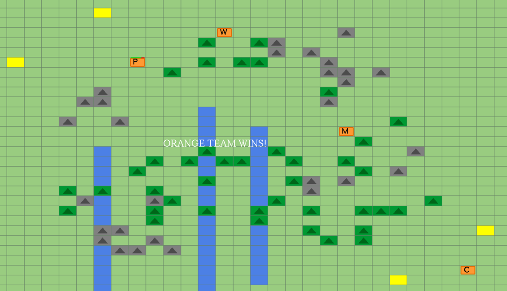
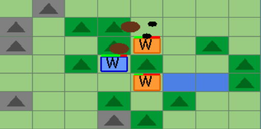
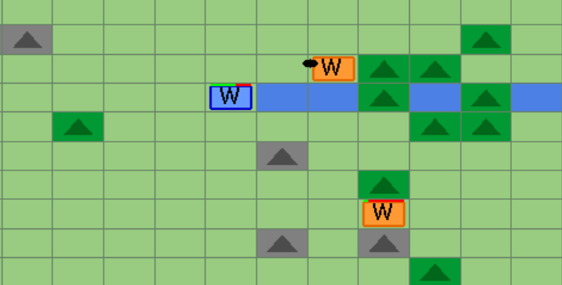
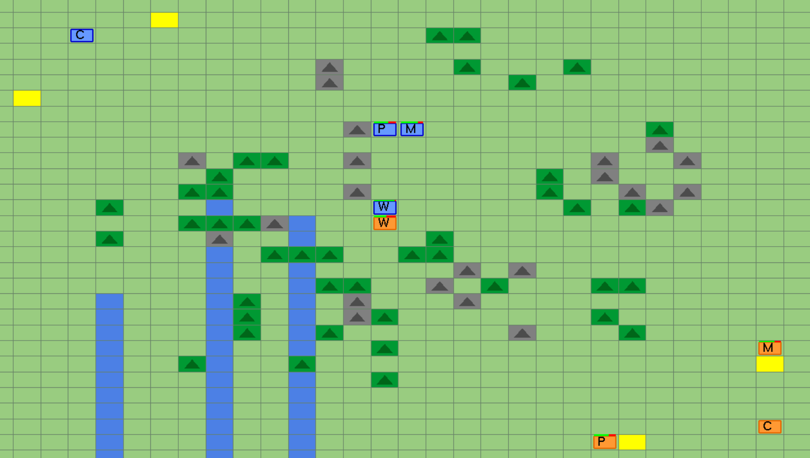

# AI Combat Simulation - Team vs Team Strategy Game

An advanced AI-driven combat simulation featuring two teams of intelligent units battling on a procedurally generated battlefield. Built with C++ and OpenGL.







## 🎮 Overview

Each team consists of 4 specialized units with unique AI behaviors:
- **Commander (C)** - Coordinates team strategy using visibility maps
- **Warriors (W)** - Combat units with A* pathfinding and tactical decision-making
- **Medic (M)** - Fast support unit (4x speed) that heals wounded warriors
- **Supply (P)** - Fast logistics unit (4x speed) that resupplies ammunition

## 🧠 AI Systems

### Core Algorithms
- **A\* Pathfinding** - Optimal navigation with dynamic safety map consideration
- **Breadth-First Search (BFS)** - Cover finding and escape route calculation
- **Bresenham's Line Algorithm** - Line-of-sight calculations with obstacle blocking
- **Dynamic Safety Maps** - Real-time danger assessment based on enemy positions
- **Loop Detection** - Prevents infinite movement patterns
- **Adaptive Escape Logic** - Forces units out of prolonged hiding (5 second limit) also prevents infinite loops

### Decision Making

**Commander:**
1. Builds team-wide visibility map from all units
2. Detects enemy positions and coordinates attacks
3. Assigns medics to wounded warriors (HP < 50)
4. Assigns supply units to low-ammo warriors (ammo < 5)
5. Switches between defense/attack modes based on team status

**Warriors:**
- Navigate to enemies using A\* pathfinding
- Shoot bullets at targets within 8 cells
- Throw grenades at distant targets (3-6 cells)
- Enter defense mode when HP < 50
- Request support from medics and supply units

**Support Units (Medic/Supply):**
- Execute commander orders and navigate to targets
- Fulfill adjacent unit requests immediately
- Return to depot after charge depletion
- Wait at depot for new orders

## ⚔️ Combat System

| Feature          | Value      |
|------------------|------------|
| Shooting Range   | 8 cells    |
| Grenade Range    | 6 cells    |
| Visibility Range | 15 cells   |
| Bullet Damage    | 4-8 HP     |
| Grenade Damage   | 8-17 HP    |
| Max Health       | 100 HP     |
| Critical Health  | 50 HP      |
| Max Ammo         | 15 bullets |
| Max Grenades     | 3 grenades |

### Game Modes

**Attack Mode** - Default state when team is strong:
- Warriors pursue nearest visible enemies
- Automatic shooting and grenade throwing
- Dynamic target switching

**Defense Mode** - Activated when HP < 50 or team ≤2 members:
- Find nearest cover using BFS algorithm
- Navigate to cover using A* with safety consideration
- Request medic/supply support
- Non-combat units retreat to safe positions

## 🗺️ Map Features

### Terrain Types (30x30 Grid)
- **Rocks** - Block movement, shooting and visibility
- **Trees** - Allow movement, block shooting and visibility. Units inside trees become invisible to enemies outside, but can still see outward
- **Water** - Blocks movement, allows shooting and visibility

### Strategic Depots
- **Medical Depots** - Recharge medic healing charges (1 charge per heal to full HP)
- **Ammo Depots** - Recharge supply ammunition (1 charge: +10 ammo, +3 grenades)

## 🚀 Getting Started

### Prerequisites
- C++ Compiler (Visual Studio recommended)
- OpenGL
- GLUT Library
- Windows/Linux/macOS

### Building & Running

**Windows (Visual Studio):**
1. Open the `.sln` solution file
2. Build → Build Solution (F7)
3. Run (F5)

**Linux/macOS:**
```bash
g++ -o combat_sim main.cpp Unit.cpp Warrior.cpp Medic.cpp Supply.cpp Commander.cpp \
    -lGL -lGLU -lglut -std=c++11
./combat_sim
```

### Controls
- **SPACE** - Start new game / Reset
- **ESC** - Exit

## ⚙️ Performance Tuning
Game balance depends on system performance. Adjust in `Definitions.h`:

**Slow Systems (< 30 FPS):**
```cpp
const int CRITICAL_HEALTH = 60;  // Increase from 50
```
**Fast Systems (> 100 FPS):**
```cpp
const int CRITICAL_HEALTH = 30;  // Decrease from 50
```
**Why?** The `CRITICAL_HEALTH` threshold controls when warriors request medical support. Without proper tuning, matches may become endless healing cycles or one-sided battles.

## 🔧 Configuration

Key parameters in `Definitions.h`:
```cpp
const int MAP_SIZE = 30;              // Map grid size
const int MAX_HEALTH = 100;           // Unit health
const int CRITICAL_HEALTH = 50;       // Defense mode threshold
const int SHOOTING_RANGE = 8;         // Bullet range
const int GRENADE_RANGE = 6;          // Grenade range
const int VISIBILITY_RANGE = 15;      // Vision distance
const int WARRIOR_MOVE_FREQ = 30;     // Frames per move (0.5 sec at 60 FPS)
const int MEDIC_MOVE_FREQ = 8;        // 4x faster (0.13 sec at 60 FPS)
const int SUPPLY_MOVE_FREQ = 8;       // 4x faster (0.13 sec at 60 FPS)
```

## 🎨 Visual Design

**Color Scheme:**
- Team Blue: Light blue 
- Team Orange: Orange 
- Background: Light green terrain
- Rocks: Gray
- Trees: Dark green
- Water: Blue
- Depots: Yellow

**Unit Symbols:**
`C` Commander | `W` Warrior | `M` Medic | `P` Supply

## 📁 Project Structure
```
AI-Combat-Simulation/
├── images/                       # Screenshots
├── CompareNodes.h               # A* priority queue comparator
├── Definitions.h                # Game constants and colors
├── Node.h                       # Pathfinding node structure
├── Unit.h / Unit.cpp           # Base unit class
├── Commander.h / Commander.cpp
├── Warrior.h / Warrior.cpp
├── Medic.h / Medic.cpp
├── Supply.h / Supply.cpp
├── Projectiles.h                # Visual effects system
├── main.cpp                     # Game loop and rendering
├── README.md
└── .gitignore
```

## 🎓 Technical Highlights

**Algorithms:**
- A\* pathfinding with heuristic search
- Breadth-First Search for cover finding
- Bresenham's line algorithm for visibility
- Priority queue for efficient A* implementation

**Design Patterns:**
- Object-oriented inheritance hierarchy
- Polymorphism with virtual update() methods
- Finite state machines for behavior switching
- Event-driven architecture for commander orders

**Real-Time Systems:**
- 60 FPS game loop with frame-based updates
- Variable movement speeds per unit type
- Synchronized global frame counter

## 🏆 Victory Conditions

The game ends when all units of one team are eliminated. The surviving team wins!

## 📝 License

Educational project created for academic purposes.

## 👨‍💻 Authors

Created as a university final project demonstrating AI algorithms, game theory, and real-time strategy implementation in C++.

---

**Enjoy the strategic AI battle!** 🎮⚔️